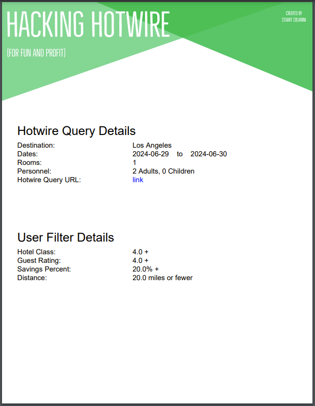
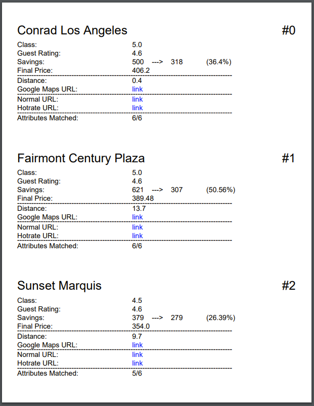
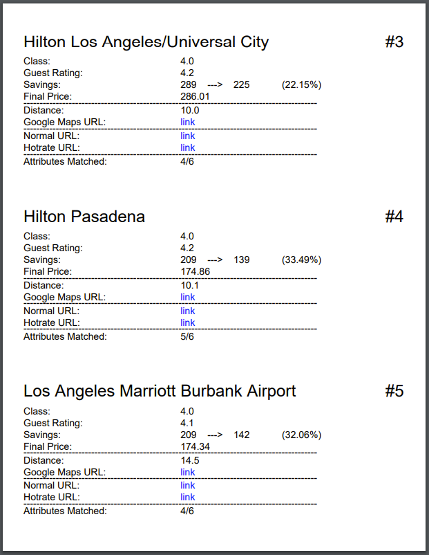
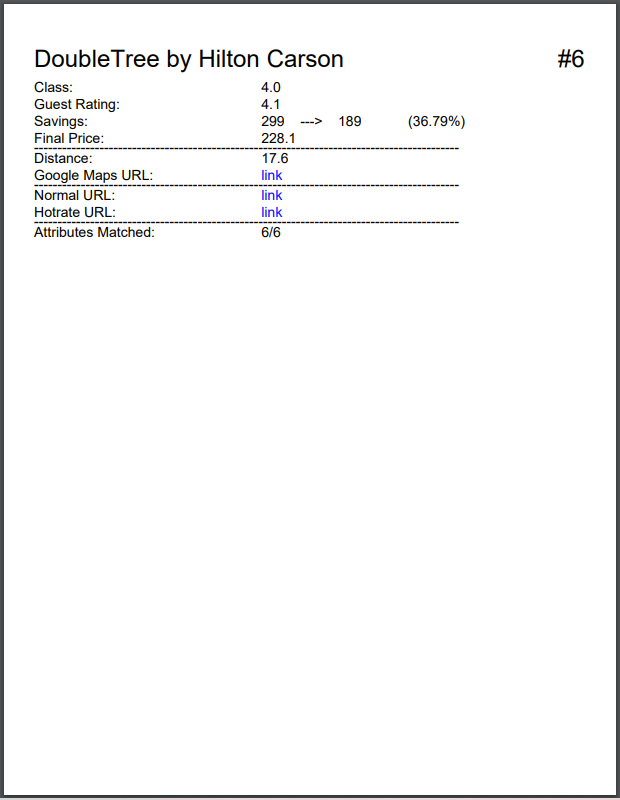

This project decodes which specific hotels are on sale on Hotwire, and organizes the results in a pdf.

## Results
See below pages of a [final report](https://github.com/scoliann/HackingHotwire/blob/master/reports/vacation_to_LA_(2024.06.29_to_2024.06.30).pdf) with decoded hotel listings, links, etc:

<!-- Final Report -->
<p align="center">
  
  
  
  
</p>

## Inspiration
While looking up "travel hacking" tips, I came across a YouTube video in which a young vlogger demonstrated how they get good hotel deals on Hotwire.  Essentially, by comparing listed metrics and attributes of the unknown and known hotels, it is possible to find ones that are perfect, or near perfect, matches.  This proect automates the process and produces a handy pdf report with all relevant data, links, etc.

## Demo / Use
A brief video outlining the code, setup, and demonstrating a run can be found [here](https://youtu.be/zs6pJn7HzG8)!

This code has been used to find hotel deals on two different family vacations!  

## Setup
1.  Create and activate conda environment via:
```
    conda env create -f environment.yml
    conda activate env_hacking_hotwire
```

2.  Chromedriver Google Chrome:

The following are the steps used to set up Google Chrome and Chromedriver on a Windows machine.  Adjust the files downloaded, and update the code as needed for Linux and Mac.

- Set up Chromedriver:
  - Go to https://chromedriver.storage.googleapis.com/index.html?path=98.0.4758.80/
  - Download `chromedriver_win32.zip` to `browser`
  - Unzip `chromedriver_win32.zip`
- Set up Google Chrome:
  - Go to https://commondatastorage.googleapis.com/chromium-browser-snapshots/index.html?prefix=Win/948375/
  - Download `chrome-win.zip` to `browser`
  - Unzip `chrome-win.zip`

## Execution

1.  Update parameters in `input_arguments.py`:
```
    report_name             = The name of the final PDF report
    hotel_filter            = {
                                'f_hotel_class': Minimum number of stars on five point scale
                                'f_geographic_distance': Maximum distance from geographic_goto_address, if provided
                                'f_savings_pct': Percentage of savings 
                                'f_guest_rating': Guest rating on five point scale
                              }
    geographic_goto_address = Optional address you would like to find a hotel near
    search_query_url        = URL of your Hotwire query
    hack_mode               = Leave as 'basic' for faster runtime; 'advanced' is an alternative with more checks
    generate_report         = Leave as True to generate a report
```

Here is an example of the input arguments completed:
```
    report_name             = 'vacation_to_LA_(2024.06.29_to_2024.06.30)'
    hotel_filter            = {
                                'f_hotel_class': 4.0, 
                                'f_geographic_distance': 20.0, 
                                'f_savings_pct': 20.00, 
                                'f_guest_rating': 4.0
                              }
    geographic_goto_address = '200 N Spring St, Los Angeles, CA 90012'
    search_query_url        = 'https://www.hotwire.com/hotels/search?destination=Los%20Angeles&startDate=06-29-2024&endDate=06-30-2024&rooms=1&adults=2&children=0'
    hack_mode               = 'basic'
    generate_report         = True
```

2.  Run code:
```
    python HackingHotwire.py
```

## Report
The output of running the program is a nice PDF report of the hotel deals that meet the user-specified parameters.

The cover page lists Hotwire Query Details and User Filter Details:
<!-- Final Report -->
<p align="center">
  
</p>

The subsequent pages list the details for each hotel:
<p align="center">
  
</p>

The Google Maps URL links to a Google Maps page between the `geographic_goto_address` and the hotel address.  The Normal URL links to the hotel's page on Hotwire, and the Hotrate URL links to the "disguised" hotel page, where you can claim the deal.

## Miscellaneous
- The code is not perfect:  
  - If Hotwire changes it's webpage, the code will need to be updated.
  - I've discovered some much better Selenium practices since I wrote this code two years ago.
  - Edge cases can be hit, e.g. a hotel deal disappearing as the code runs.


